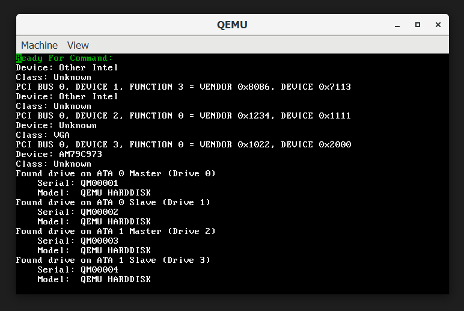
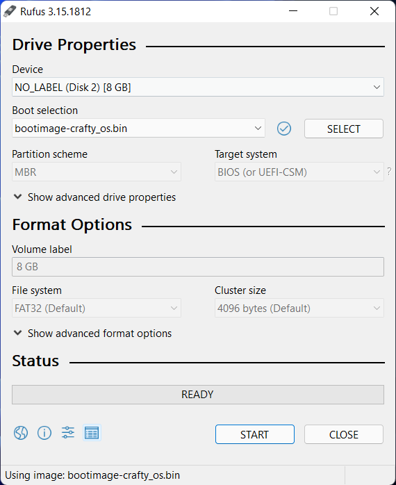
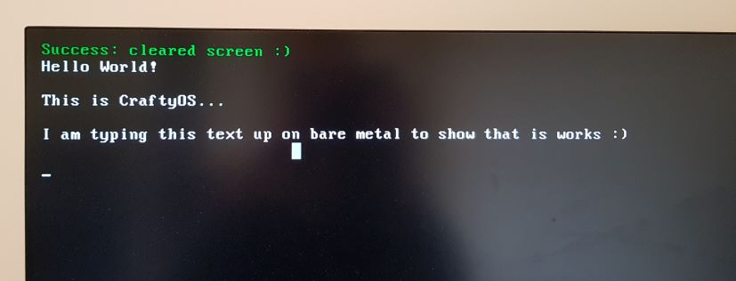
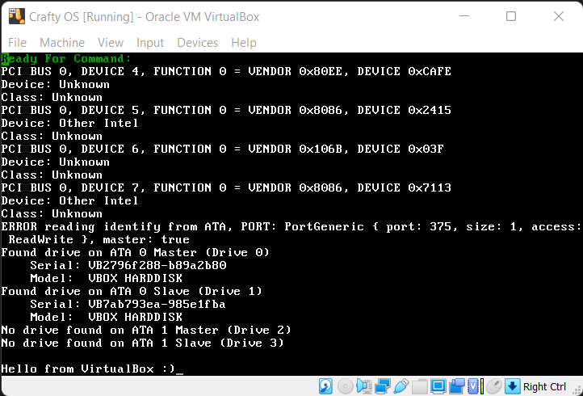
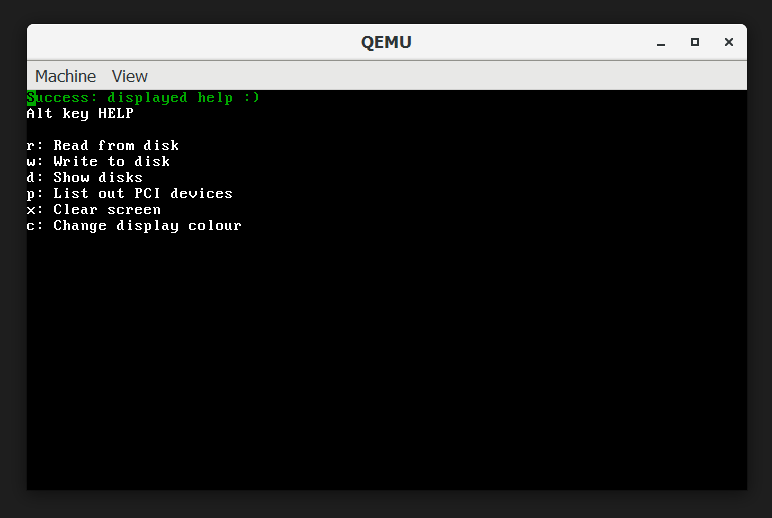
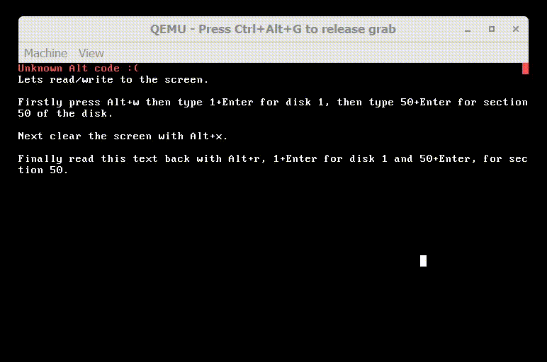
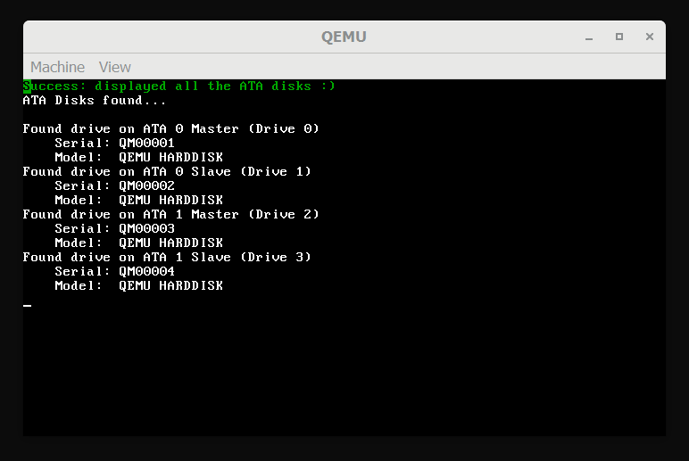
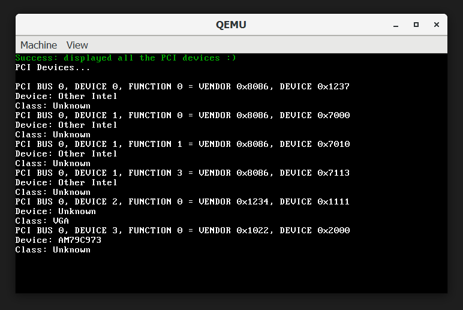
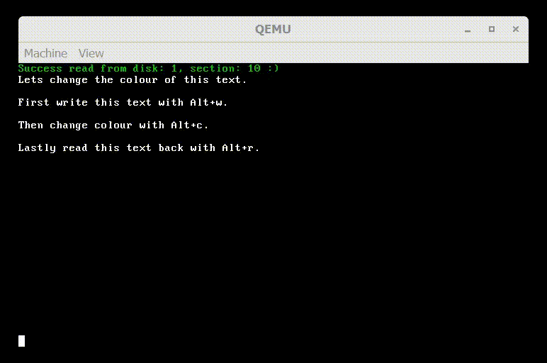
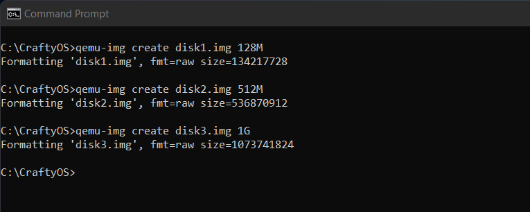

# CraftyOS
This is a school project for learning OS development. I have based this off [Phil Opp's](https://os.phil-opp.com/) great rust OS tutorial. I have also drawn inspiration from [WYOOS's](https://www.youtube.com/playlist?list=PLHh55M_Kq4OApWScZyPl5HhgsTJS9MZ6M) YouTube series on writing an OS in C++.

I am also maintaining a blog for this project for assessment purposes at https://craftydh.github.io/CraftyOS-Blog/.

# Requirements
1. Rust which can be aquired from from http://rustup.rs
2. Rust nightly with can be installed with ```rustup toolchain install nightly```
3. [Cargo bootimage](https://github.com/rust-osdev/bootimage) tool which can be installed with ```cargo install bootimage```
## Optional Requirements
1. Qemu for debugging from https://www.qemu.org/download/
2. Virtualbox / VMware for testing
3. [Rufus](https://rufus.ie/en/) for flashing to a usb.

# Building and running
To build and run the OS in debug mode simply run ```cargo run```. In order to run a release build pass the flag --release for example ```cargo run --release```. WARNING: do not use cargo build as this prevent the cargo bootimage tool from bundling the bootloader with the kernel. Upon a successfull boot qemu should look like the following picture.


## Boot from real hardware
Firstly build a release build as shown above. Secondly boot rufus and select device as your usb, in boot selection choose bootimage-crafty_os.bin which can be found at 'CraftyOS/target/x86_64-crafty_os/release/bootimage-crafty_os.bin'. Then click start. WARNING: Ensure QEMU is closed as it will prevent rufus from reading the file,



The next step is to get your BIOS to boot the USB. Once that is done as shown bellow it boots up successfully and the keyboard and mouse work fabously. Though the mouse seems to not work on every system that I have tried it on.



## Boot from VirtualBox
Firstly build a release build as shown above. Secondly convert the bootimage-crafty_os.bin file which can be found at 'CraftyOS/target/x86_64-crafty_os/release/bootimage-crafty_os.bin' to a .vmdk. This can be done with qemu-img by executing ```qemu-img convert -f raw -O vmdk bootimage-crafty_os.bin crafty_os.vmdk``` this command proves no output other that creating the file.

In virtualbox create a new vm of Other/Unknown (64 bit). Within virtualbox you may add more disks to the IDE interface and they will be found by CraftyOS. As shown below it successfully boots up and works.


# Alt codes
In CraftyOS user interation is via Alt codes. To access the help menu at any time press (Alt+h) this will show the following help interface showing what keys do which tasks.


## Clear Screen
Use Alt+x to fully clear the screen with spaces.

## Read from disk
This will read the contents from the given disk and section to the screen buffer. The commands are Alt+r, disk_num + Enter, section_num + Enter. As in the GIF below read / writing is a simple mechanic.

## Write to disk
This has the same command's as reading except use the Alt code Alt+w and it will dump the current screen buffer to that address.



## Show Disks
This will list out every ATA disk found with a small amount of meta data. It's alt code is Alt+d and a sample output with 4 disks is shown below.



## Show PCI Devices
This will list out each PCI device connected to the system as well as a device name (if known)
and a class name (if known). An example output is shown below.



## Colour
This will set the forground and backgound colour to one of the 15 avaible coulous of your choice. An example GIF of it's use is shown below.




## Problems
### Cargo bootimage tool not installed
If the following error occurs please ensure that the bootimage tool is installed and in your system PATH.
```sh
    Finished dev [optimized + debuginfo] target(s) in 0.12s
     Running `bootimage runner target\x86_64-crafty_os\debug\crafty_os`
error: could not execute process `bootimage runner target\x86_64-crafty_os\debug\crafty_os` (never executed)

Caused by:
  The system cannot find the file specified. (os error 2)
```

# Qemu disks
To create a new disk called disk1 with a capacity of 128MiB execute ```qemu-img create disk1.img 128M```. To attach the disk uncomment the disk within cargo.toml found on the root of the project. 
```toml
run-command = [
    "qemu-system-x86_64", 
    "-drive", "format=raw,file={},if=ide",        # ATA 0 Master (Disk 0)
    "-drive", "format=raw,file=disk1.img,if=ide", # ATA 0 Slave  (Disk 1)
#    "-drive", "format=raw,file=disk2.img,if=ide", # ATA 1 Master (Disk 2)
#    "-drive", "format=raw,file=disk3.img,if=ide", # ATA 1 Slave  (Disk 3)
]
```
For example as shown below I created 3 disks of various sizes, and connected all of the disks in the cargo.toml file as shown above.


After executing the Alt code for disks (Alt+d), it can be seen that there are 4 QEMU-disks connected.


